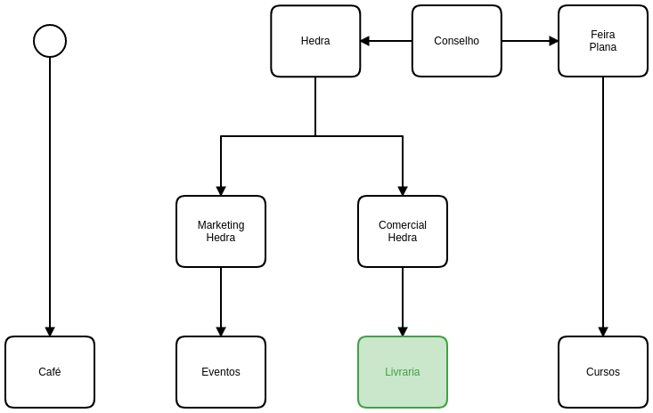

==================
Livraria e eventos
==================

A Casa Plana é um conjunto de três unidades de negócio
com diretorias distintas. 
 
-----------------------------
Do acordo entre Hedra e Plana
-----------------------------

A ``Livraria``  e os ``Eventos`` estão subordinados à Hedra. 

Isto significa que as operações da ``Livraria`` dependem dos processos do 
departamento comercial da Hedra. E as operações 
dos `Eventos` dependem dos processos do Marketing. 

As principais operações são:

Name | Lunch order | Spicy      | Owes
------- | ---------------- | ---------- | ---------:
Joan  | saag paneer | medium | $11
Sally  | vindaloo        | mild       | $14
Erin   | lamb madras | HOT      | $5

| Comercial       | Marketing   |
|-----------------|-------------|
| Logística       | Campanha    |
| Negociação      | Resultados  |
| Infraestrutura  | Comumicação |

.. Important::
	A identidade da Casa Plana, porém, é uma responsabilidade da empresa Bia Bittencourt ME
	e as decisões ou divergências devem ser discutidas em conselho e não administrativamente. 

Do fluxo de atividades e responsabilidades dos eventos
======================================================

Um evento precisa ser:

* proposto e aprovado;
* divulgado;
* executado;
* e, por fim, repercutir. 

Estas são as operações sob a responsabilidade do Marketing da Hedra, que deve 
tocar a campanha, comunidar e apresentar resultados.

É necessário ainda que o comercial se responsabilize pelas seguintes operações:

* negociação com os envolvidos no evento;
* logística para recebimento dos livros;
* e acerto financeiro.

.. image:: ./bpmn/eventos.png

 

Proposta de eventos
-------------------

**Responsáveis**: coordenador de eventos

Os eventos podem ser propostos por todos. Eventos que ferem a 
identidade da Plana serão recusados. 

Isto é feito pelo board do trelo `Eventos`_.

.. _Evendos: https://trello.com/b/8SLdxvPT/plana-eventos

O coordenador de eventos é responsável pelo board do Trello e pelo acompanhamento dos prazos. 

.. Important::
	Nem todos os eventos devem ser divulgados. 

Divulgação
----------

**Responsáveis**: coordenador de eventos; gerente de marketing; Bia Bittencourt

A divulgação e o plano de mídia devem ter orçamentos definidos previamente pela equipe Marketing da Hedra. 
Isto deve estar contido em uma planilha de gastos e de busca de resultados. 

.. Important::
	As peças de divulgação são aprovadas pela Bia Bittencourt. 

Execução
--------

**Responsáveis**: coordenador de eventos

A execução inclui tudo que é necessário para o cerimonial do evento. 

Todo evento é responsabilidade de apenas uma pessoa, designada previamente. 
A princípio esta pessoa é o coordenador de eventos. 

O cronograma deve ser apresentado semanalmente à equipe comercial, 
segundo o :ref:`calendário de reuniões`.

 
.. Important::
	É necessário que o coordenador de eventos preencha a `planilha de resultados de eventos`_
	evento, especificando quantos livros do lançamento foram vendidos
	e quem foi responsável por isso. 

.. _planilha de resultados de eventos: https://docs.google.com/spreadsheets/d/1Ixkt2ObKy0oKJKpnteWgw5TEGqtxYKPoYNNBeWEZnCs/edit?usp=sharing

Repercussão e pós-produção
--------------------------

Após os eventos, o material de divulgação deve ser arquivado.
Este material deve estar acessível para o público por algum canal.

.. Note:: 
	Este procedimento precisa ser discutido. 
 	

Cadastros, pedido e recebimento de mercadorias
-----------------------------------

**Etapas de cadastro**:

* :ref:`Cadastro de fornecedores`
* :ref:`Cadastro de produtos`
* :ref:`Pedidos de mercadoria` (PO)

Todas essas tarefas devem ser feitas pelo Odoo.

.. Important::
	A comunicação com os fornecedores ou com o pessoal interno deve ser 
	feita pelo Odoo, diretamente nos documentos específicos. 

Acerto de mercadoria
--------------------

Preparativos para eventos
-------------------------

Acertos de consignação provisório
---------------------------------

* Cadastrar os clientes

